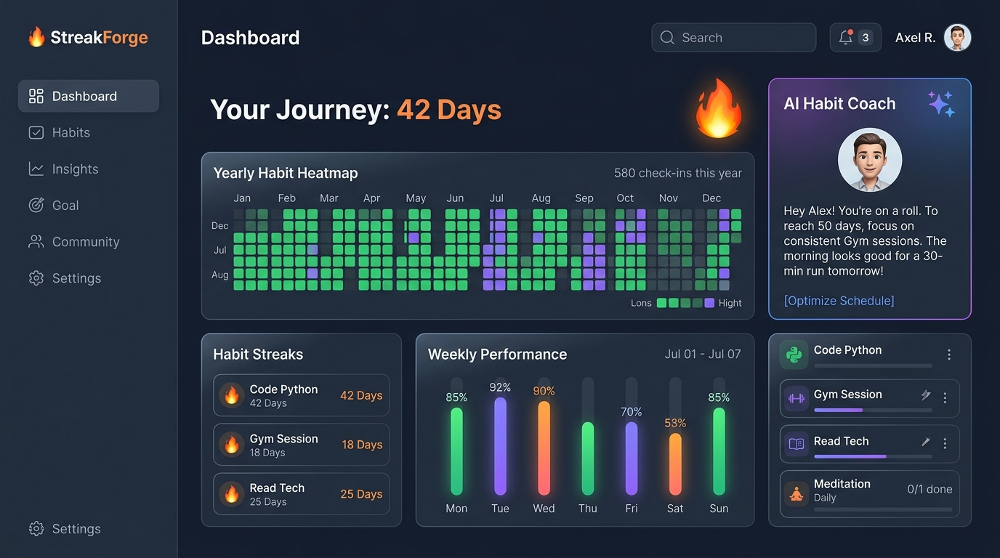

# StreakForge ⚡

> **Production-grade MERN Stack Habit & Streak Tracker with Intelligent AI Coaching**

StreakForge is a modern web application designed for habit formation, streak preservation, and personalized behavioral coaching. It pairs a timezone-aware streak engine with interactive GitHub-style heatmaps, Recharts analytics, and Google Gemini AI integration.



---

## 🌟 Key Features

### 1. Dual-Token JWT Authentication & Security
- **Access & Refresh Tokens**: 15-minute access token in memory + 7-day refresh token stored in an `httpOnly`, `SameSite: Lax` secure cookie.
- **Silent Refresh Flow**: Client Axios interceptor detects 401s and transparently refreshes the session without user interruption.
- **Enterprise Security**: Hardened with `helmet`, strict CORS whitelisting, `express-mongo-sanitize` against NoSQL injection, and `express-rate-limit` (general, auth, and AI tiers).
- **User Scoping**: Every database query is scoped strictly to the authenticated `userId`.

### 2. Habit Management & Daily Check-ins
- **Full CRUD**: Title, description, categories (*Health, Study, Fitness, Mindfulness, Work, Other*), custom color accents, and emoji icons.
- **Custom Frequencies**: Supports daily rituals or specific days of the week (e.g., Mon/Wed/Fri).
- **Graceful Archiving**: Soft archive/restore habits while preserving full streak histories, with permanent deletion available.
- **1-Click Check-in**: Instant visual feedback with audio/celebration animations.
- **7-Day Backfill Grace Period**: Log past days within a 7-day window with optional reflection notes.

### 3. Timezone-Aware Streak Engine
- **Accurate Scheduling**: Off-days never break your streak (e.g. a Mon/Wed/Fri habit retains its streak through Tuesdays and weekends).
- **Streak-at-Risk Detection**: Today's pending habit preserves previous momentum and visually warns the user before midnight.
- **Timezone Normalization**: Dates are normalized to each user's local timezone (e.g. `America/New_York`, `Asia/Tokyo`).
- **Comprehensive Unit Testing**: 11 Jest test cases covering gaps, non-scheduled days, backfilling, new habits, and boundary limits.

### 4. Visual Analytics & Milestone Badges
- **GitHub-Style Contribution Heatmap**: Custom 52-week x 7-day SVG grid per habit with month headers, day labels, and hover tooltips.
- **Weekly Completion Charts**: Dynamic Recharts bar graph visualizing daily completion percentages and habit ratios.
- **Milestone Badges**: Unlock *Week Warrior* (7d), *Habit Master* (30d), *Century Forge* (100d), and *Unstoppable Legend* (365d) with confetti celebrations (`canvas-confetti`).

### 5. Google Gemini AI Integration
- **AI Habit Generator**: Turns natural goals (*"I want to run a 5k and sleep deeper"*) into 3-5 structured habit blueprints with 1-click adoption.
- **AI Weekly Coach Report**: Analyzes 30-day historical logs, identifies peak and vulnerable days, and generates 3 actionable behavioral tips. Cached in MongoDB for 24 hours to prevent redundant compute.
- **Streak-at-Risk Motivation**: Personalized encouragement when a streak is in jeopardy.
- **ForgeBot Interactive Chat**: Conversational habit coach aware of your tracked habits.
- **Resilient Fallbacks**: If the Gemini API key is not yet set or reaches quota, intelligent fallback models ensure uninterrupted functionality.

### 6. Profile, Themes & Data Portability
- **Timezone Auto-Detection**: One-click timezone detection via browser API.
- **Appearance**: Dark Slate theme with neon accents and Light mode toggle.
- **Data Export**: Export your complete habit and log history in **JSON** (full backup) or **CSV** (spreadsheet-ready).

---

## 🛠 Tech Stack

| Layer | Technologies |
| :--- | :--- |
| **Frontend** | React 18 (Vite), React Router v6, Tailwind CSS, Zustand, Recharts, Lucide Icons, React Hot Toast, Canvas Confetti |
| **Backend** | Node.js, Express, MongoDB, Mongoose |
| **Auth** | JSON Web Tokens (`jsonwebtoken`), `bcryptjs`, `cookie-parser` |
| **Validation** | Zod |
| **AI** | Google Gemini API (`@google/generative-ai`) wrapped in service layer |
| **Testing** | Jest |

---

## 📁 Monorepo Structure

```
streakforge/
├── package.json               # Root scripts: dev (concurrently), test, seed, build
├── .gitignore
├── README.md
├── server/
│   ├── package.json
│   ├── .env.example
│   ├── src/
│   │   ├── config/            # Database (Mongoose) and Environment configuration
│   │   ├── models/            # User, Habit, HabitLog, AIInsight schemas
│   │   ├── middleware/        # JWT auth, Zod validation, error handler, rate limiter
│   │   ├── services/          # Pure streak engine, auth, stats, export, Gemini AI service
│   │   ├── controllers/       # HTTP controllers (auth, habit, log, stats, AI, user)
│   │   ├── validations/       # Zod schemas for all requests and responses
│   │   ├── routes/            # REST routing prefixed /api/v1
│   │   ├── scripts/seed.js    # Rich demonstration dataset seeder
│   │   ├── tests/             # Unit tests for streak engine edge cases
│   │   └── server.js          # Express entry point
└── client/
    ├── package.json
    ├── vite.config.js         # API proxying to port 5000
    ├── tailwind.config.js
    └── src/
        ├── api/               # Axios client with silent 401 refresh interceptor
        ├── store/             # Zustand stores (authStore, habitStore, themeStore)
        ├── components/
        │   ├── common/        # Buttons, Modals, Badges, Loaders
        │   ├── layout/        # Navbar, Footer, AppShell
        │   ├── habits/        # HabitCard, HabitFormModal, BackfillModal
        │   └── stats/         # GitHubHeatmap, WeeklyChart, StatCards, MilestoneBadges
        ├── pages/             # Landing, Login, Register, Dashboard, Habits, HabitDetail, AICoach, Settings
        └── routes/            # PrivateRoute and PublicRoute wrappers
```

---

## 🚀 Quickstart & Local Setup

### 1. Prerequisites
- **Node.js**: v18 or higher (tested on Node v24.14.0)
- **MongoDB**: Running locally on port `27017` or a MongoDB Atlas URI

### 2. Clone & Install Dependencies
From the repository root:
```bash
# Install root, backend, and frontend dependencies
npm run install:all
```

### 3. Environment Variables
Both `server/.env` and `client/.env` have been created with pre-configured defaults:

**`server/.env`**:
```env
PORT=5000
NODE_ENV=development
CLIENT_URL=http://localhost:5173
MONGO_URI=mongodb://127.0.0.1:27017/streakforge

# JWT Secrets
JWT_ACCESS_SECRET=streakforge_jwt_access_secret_super_secure_key_123!@#
JWT_REFRESH_SECRET=streakforge_jwt_refresh_secret_super_secure_key_456!@#
JWT_ACCESS_EXPIRY=15m
JWT_REFRESH_EXPIRY=7d

# Google Gemini API Key (Optional for smart fallback, required for live AI)
GEMINI_API_KEY=
```

**`client/.env`**:
```env
VITE_API_BASE_URL=/api/v1
```

### 4. Seed Demo Data (Optional)
To populate the database with sample habits, historical logs, and pre-cached AI insights for testing:
```bash
npm run seed
```
> **Sample Login (if seeded):**
> - Email: `alex@streakforge.io`
> - Password: `Password123!`

### 5. Run the Application
Start both the Express backend and the Vite frontend simultaneously with a single command:
```bash
npm run dev
```

- **Frontend Client**: [http://localhost:5173](http://localhost:5173)
- **Backend API**: [http://localhost:5000/api/v1/health](http://localhost:5000/api/v1/health)

---

## 🧪 Running Automated Tests

Run the Jest unit test suite for the streak engine:
```bash
npm test
```

### Test Coverage Highlights:
- ✅ New habit with no logs (`currentStreak: 0, longestStreak: 0`)
- ✅ Consecutive daily habit completion (`streak: 5`)
- ✅ Gap days properly resetting current streak while preserving longest record
- ✅ Streak-at-risk preservation when today is pending
- ✅ Custom frequency (Mon/Wed/Fri) skipping off-days without breaking streaks
- ✅ Backfilled check-in merging disconnected chains and recalculating streaks
- ✅ Timezone normalization across locales
- ✅ Strict enforcement of the 7-day backfill boundary

---

## 📡 REST API Reference (`/api/v1`)

All responses adhere to the standard envelope:
```json
{
  "success": true,
  "message": "Status description",
  "data": { ... }
}
```

### Auth (`/auth`)
| Method | Endpoint | Description | Auth Required |
| :--- | :--- | :--- | :---: |
| `POST` | `/auth/register` | Register new user, set refresh cookie | No |
| `POST` | `/auth/login` | Authenticate user, set refresh cookie | No |
| `POST` | `/auth/logout` | Clear refresh cookie | No |
| `POST` | `/auth/refresh` | Issue new access token from cookie | No |
| `GET` | `/auth/me` | Fetch authenticated user profile | Yes |

### Habits (`/habits`)
| Method | Endpoint | Description | Auth Required |
| :--- | :--- | :--- | :---: |
| `GET` | `/habits` | List active habits (filters: `includeArchived`, `category`) | Yes |
| `POST` | `/habits` | Create habit | Yes |
| `GET` | `/habits/:id` | Get habit by ID with computed streaks | Yes |
| `PUT` | `/habits/:id` | Update habit metadata | Yes |
| `DELETE` | `/habits/:id` | Permanently delete habit and logs | Yes |
| `PATCH` | `/habits/:id/archive` | Toggle archived status | Yes |
| `POST` | `/habits/:id/check` | Toggle check-in for date `YYYY-MM-DD` | Yes |
| `GET` | `/habits/:id/logs` | Fetch habit logs by date range (`from`, `to`) | Yes |

### Statistics (`/stats`)
| Method | Endpoint | Description | Auth Required |
| :--- | :--- | :--- | :---: |
| `GET` | `/stats/overview` | Overall stats (total, active streaks, 7d/30d rates) | Yes |
| `GET` | `/stats/heatmap/:habitId` | 365-day array for GitHub contribution matrix | Yes |
| `GET` | `/stats/weekly` | Last 7 days breakdown for Recharts | Yes |

### AI Coaching (`/ai`)
| Method | Endpoint | Description | Auth Required |
| :--- | :--- | :--- | :---: |
| `POST` | `/ai/suggest-habits` | Generate 3-5 habit suggestions from a goal | Yes |
| `GET` | `/ai/weekly-insight` | 30-day behavioral trends (cached 24h) | Yes |
| `POST` | `/ai/motivation` | Targeted streak motivation message | Yes |
| `POST` | `/ai/chat` | Interactive conversation with ForgeBot | Yes |

### User Settings (`/users`)
| Method | Endpoint | Description | Auth Required |
| :--- | :--- | :--- | :---: |
| `PUT` | `/users/profile` | Update name, timezone, theme | Yes |
| `PUT` | `/users/password` | Change password | Yes |
| `GET` | `/users/export` | Download data (`?format=json` or `?format=csv`) | Yes |

---

## 📜 License
MIT © StreakForge Contributors.
